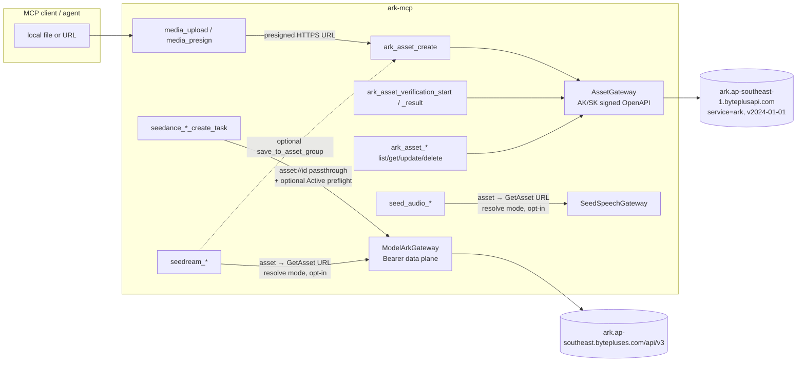
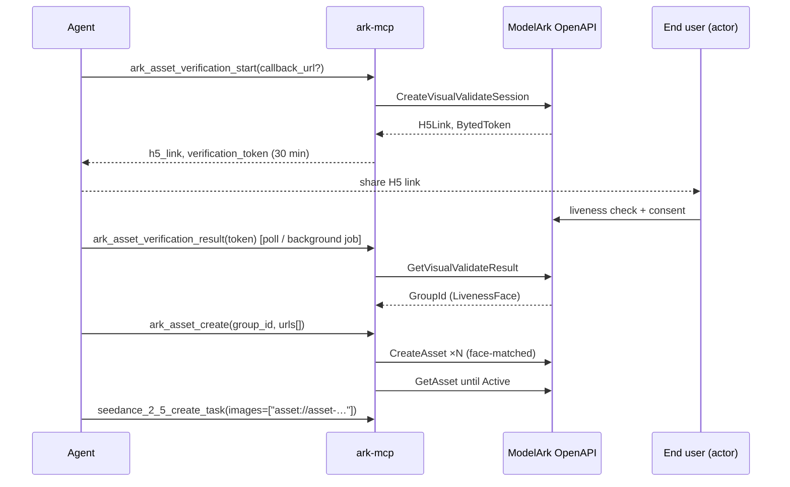

<!-- markdownlint-disable MD013 MD025 -->

# ModelArk Private Asset Library (Advanced Creation Rights)

## Outcome

Let MCP clients work with **real-human faces**, **private virtual portraits**
and **copyrighted IP assets** in generation by using the ModelArk private asset
library that comes with Dreamina Seedance Advanced Creation Rights:

1. **Manage the library.** Create asset groups, upload assets, check status,
   list, update and (optionally) delete them, all through signed ModelArk
   OpenAPI calls (AK/SK).
2. **Onboard real people.** Start a real-person verification session and
   collect the resulting asset group, so a verified person's face can be used
   in Seedance.
3. **Reference assets in generation.** Accept `asset://<asset_id>` (or an
   `asset_id` field) wherever Seedance, Seedream and Seed Audio take a
   reference.
4. **One subject per group.** Assets for the same subject (a person, a virtual
   character, a product) always land in the same asset group, and the tools
   make that the easy path instead of a convention the agent has to remember.

## Implementation status (2026-09-24)

Implemented on branch `feat/modelark-asset-library`. The shipped behavior is
documented in [`docs/assets.md`](../docs/assets.md), and the provider contract
in [`SPEC_MODELARK_ASSET_LIBRARY_CONTRACT.md`](../specs/SPEC_MODELARK_ASSET_LIBRARY_CONTRACT.md).

- **Done:** AK/SK V4 signer, `ModelArkOpenApiGateway`, `AssetService`; the 11
  `ark_asset_*` tools plus 2 opt-in delete tools; registration gated on
  `BYTEPLUS_MODELARK_ACCESS_KEY` + `_SECRET_KEY` only (no separate enable
  flag); `asset://` in Seedance 2.0/2.5 image, video and audio inputs with
  `GetAsset` preflight; Seedream / Seed Audio `off` / `resolve` modes; tests;
  docs and skill.
- **Changed from this plan:**
  - `BYTEPLUS_MODELARK_ASSETS_ENABLED` was dropped: AK/SK presence gates the
    tools.
  - The `passthrough` reference mode was dropped because Seedream and Seed
    Audio reject `asset://` (HTTP 400).
  - List tools always send `Filter.GroupType`, defaulting to `AIGC`, because
    the provider requires `Filter`.
- **Not yet built:** Seedream `save_to_asset_group` output ingestion; a live
  MCP-level smoke run of the tools.

## What the provider supports (read this first)

These facts constrain the design. They come from the official docs listed in
`source:`.

| Capability | Provider support | Consequence for this plan |
|---|---|---|
| `asset://<id>` in **Seedance 2.0 / 2.5** `content[].image_url/video_url/audio_url` | ✅ Documented; a Seedance 2.5 image-reference task completed in the 2026-09-24 live probe. | Native passthrough. This is the main feature. |
| `asset://<id>` in **Seedream** `image` | ❌ Seedream 5.0 Pro returned HTTP 400 `InvalidParameter` for the asset URI in the live probe. | No native support. See [Seedream and Seed Audio](#seedream-and-seed-audio-no-native-asset-support). |
| `asset://<id>` in **Seed Audio** `references[]` | ❌ Seed Audio 1.0 returned HTTP 400 code `45001132` for the asset URI in the live probe. | Same as Seedream. |
| Virtual portrait groups (`GroupType=AIGC`) | ✅ `CreateAssetGroup` + `CreateAsset` | Full API management. |
| Real-human groups (`GroupType=LivenessFace`) | ✅ `CreateVisualValidateSession` → end user does liveness check on H5 page → `GetVisualValidateResult` returns `GroupId` → `CreateAsset` | Groups cannot be created by name; they come only from a verification. Uploads are face-matched against the verified person. |
| Real-human assets **authorized by another account** (console QR flow) | Usable with `asset://` in Seedance; **cannot** be queried, updated or deleted with the management APIs | Passthrough only. Preflight status checks must tolerate "not found". |
| Copyrighted IP library | Console only (Model Playground → Copyright Library). No API for listing or creating. CJ7 content costs 1.1× the video price. | Passthrough of asset IDs copied from the console. No management tools. |
| Asset management auth | AK/SK, BytePlus OpenAPI v4 HMAC-SHA256, service `ark`, version `2024-01-01`, host `ark.ap-southeast-1.byteplusapi.com` | New signed gateway. Not the Bearer data-plane key. |
| Project isolation | Assets live in a `ProjectName` (default `default`). They only work with inference endpoints in the same project. | One configured project, overridable per call. Surface mismatches clearly. |

### Rights tiers (limits the server must respect)

| Tier | API access | Assets / groups | `CreateAsset` rate |
|---|---|---|---|
| Basic (free) | ❌ Console only | 50 / 50 | 3 QPM |
| Advanced Entry (free) | ✅ | 50 / 50 | 3 QPM |
| Advanced ($1,400/mo) | ✅ | 1M / 1M | 120 QPM |
| Advanced Premium ($4,200/mo) | ✅ | 5M / 5M | 300 QPM |

Other rate limits apply to every account: `GetAsset` 100 QPS,
`DeleteAssetGroup` 5 QPS, `CreateVisualValidateSession` and
`GetVisualValidateResult` 3 QPS, all other calls 10 QPS.

Expiry: in the 0–15 day grace period after a paid tier lapses, you can't
create new assets or groups but existing assets still work. After 15 days,
assets and groups created during the paid period are **deleted permanently**.
The docs must warn about this.

### Asset file rules (enforced locally before upload)

| Type | Formats | Limits |
|---|---|---|
| Image | jpeg, png, webp, bmp, tiff, gif, heic/heif | W/H ratio (0.4, 2.5); each side 300–6000 px; < 30 MB |
| Video | mp4, mov | 2–30 s; 480p/720p/1080p/4K; ratio [0.4, 2.5]; each side 300–6000 px; total pixels [407,696, 8,295,044]; ≤ 200 MB; 24–60 fps |
| Audio | wav, mp3 | 2–30 s; ≤ 15 MB |

`CreateAsset` takes **one publicly reachable URL per call**. Base64 is not
accepted. It is asynchronous: poll `GetAsset` until `Status` is `Active`
(usable) or `Failed`. The `URL` returned by `GetAsset` is a presigned TOS link
that expires after about 12 hours. Never persist it; `asset://<id>` is the
durable reference.

## Architecture





### Key decisions

1. **A separate `ModelArkOpenApiGateway`, not an extension of
   `ModelArkGateway`.** The two differ in host, auth (HMAC v4 vs Bearer),
   response envelope (`ResponseMetadata` + `Result` vs OpenAI-style) and error
   shape. It subclasses `BaseHttpGateway`, so it keeps the shared timeout,
   metrics, tracing and retry behaviour. The v4 signer is restored from git
   history (`git show 9490742^:src/ark_mcp/providers/vod/client.py`), moved
   into a shared `providers/byteplus_openapi/signing.py`, and parameterised by
   service and region. Its algorithm is already specified in
   `specs/SPEC_VOD_OPENAPI_PROVIDER_CONTRACT.md`.
2. **Disabled by default.** `BYTEPLUS_MODELARK_ASSETS_ENABLED=true` and both
   `BYTEPLUS_MODELARK_ACCESS_KEY` and `BYTEPLUS_MODELARK_SECRET_KEY` are
   required to register the management tools. `asset://` passthrough into
   Seedance needs **no** AK/SK, because it's plain data-plane input. It is
   always on once the Seedance tools are registered, so console-created and
   console-authorized assets work for every user.
3. **One subject per group is enforced by the tool shape**, not by docs alone
   (see [Grouping rules](#grouping-rules-same-subject--same-group)).
4. **Delete is irreversible and gated separately**
   (`BYTEPLUS_MODELARK_ASSETS_ALLOW_DELETE`, default `false`). Delete tools
   carry `destructiveHint: true` and require `confirm: true` in the call.
5. **Seedream and Seed Audio resolution is opt-in and labelled
   experimental**, because it sits outside the documented asset contract (see
   below).

## Grouping rules: same subject → same group

The provider treats an asset group as "one person / one character".
Real-human groups reject faces that don't match the verified person, and
docs say *"Uploading materials of different individuals to the same material
group is not supported."* The server makes that the default:

- **Group identity.** Tools accept either `group_id`, or a `subject` name
  (AIGC groups only). With `subject`, `ark_asset_group_ensure` calls
  `ListAssetGroups` with a `Name` fuzzy filter, keeps only **exact**
  case-sensitive name matches in the configured project, and creates the group
  if there is none. Two or more exact matches → an `ambiguous_asset_group`
  error listing the IDs; the tool never picks one silently.
- **Batch upload into one group.** `ark_asset_create` takes a list of sources
  and **one** group target. The contract is "these files are the same
  subject". There is no multi-group batch tool.
- **Group type safety.** `LivenessFace` groups can't be created by
  name. `subject=` resolves only `AIGC` groups. A real person's group always
  comes from `ark_asset_verification_result` or an explicit `group_id`.
- **Generated output back into the subject's group.** Seedream
  `generate/edit` get an optional `save_to_asset_group` (`group_id` or
  `subject`). When it's set, each output image is registered with
  `CreateAsset` in that group after generation, using the provider's output
  URL, which is valid for 24 h. This is how a character sheet made in
  Seedream becomes Seedance-ready assets of the same subject. For
  `LivenessFace` groups the provider's face match still applies, and a
  per-asset failure is reported without failing the generation.
- **Name hygiene.** Group names are validated as 1–64 chars. Asset `Name`
  defaults to the source filename stem, for search in `ListAssets`. Tool
  descriptions state that the model **does not** see `Name` and that prompts
  must say "Image 1 / Video 1" by position.

## Tool surface

All names use an `ark_asset_` prefix. Every model field gets a
`Field(description=...)` per the Tool Contract Rules.

| Tool | Provider action(s) | Scope | Notes |
|---|---|---|---|
| `ark_asset_group_ensure` | `ListAssetGroups`, `CreateAssetGroup` | `assets:write` | Idempotent by exact `subject` name. AIGC only. Returns `{group_id, created: bool}`. |
| `ark_asset_group_create` | `CreateAssetGroup` | `assets:write` | Explicit create (`name`, `description`). Always creates. |
| `ark_asset_group_get` / `ark_asset_group_list` | `GetAssetGroup` / `ListAssetGroups` | `assets:read` | Filters: `name` (fuzzy), `group_ids`, `group_type` (`AIGC` / `LivenessFace`). `NextToken` paging with `max_results` (default 20). |
| `ark_asset_group_update` | `UpdateAssetGroup` | `assets:write` | Name and description only. |
| `ark_asset_create` | `CreateAsset` ×N, then `GetAsset` polling | `assets:write` | Up to 20 `sources` into one group (`group_id` **or** `subject`). Each source is `{url}` or `{object_key}`; object keys are presigned through the configured TOS/S3 backend. `asset_type` is inferred from the extension or MIME type, or given explicitly. Optional `moderation: "default" \| "skip"`; `skip` works only when content pre-filter is turned off in the console, and the description says so. `wait_until_active` defaults to `true` with a bounded timeout (default 120 s). Returns per-source `{asset_id, asset_uri, status, error?}`; partial failures are reported inline. Background-job capable (`mode="optional"`). |
| `ark_asset_get` / `ark_asset_list` | `GetAsset` / `ListAssets` | `assets:read` | `ark_asset_list` filters: `group_ids`, `group_type`, `statuses`, `name`, `sort_by`, `sort_order`. The output includes `last_inference_time`. The temporary `preview_url` is labelled as expiring and not reusable in generation. |
| `ark_asset_update` | `UpdateAsset` | `assets:write` | Name only. |
| `ark_asset_delete` / `ark_asset_group_delete` | `DeleteAsset` / `DeleteAssetGroup` | `assets:delete` | Registered only with `ALLOW_DELETE`. `confirm: true` required. `destructiveHint`. |
| `ark_asset_verification_start` | `CreateVisualValidateSession` | `assets:verify` | Input `callback_url` (HTTPS, optional; defaults to `BYTEPLUS_MODELARK_ASSET_VERIFY_CALLBACK_URL`) and `language` (`en` / `zh` / `zh-Hant`, appended as `lng`). Returns `h5_link`, `verification_token`, `expires_at` (token valid 30 min). |
| `ark_asset_verification_result` | `GetVisualValidateResult` | `assets:verify` | Returns `{status: pending \| verified \| failed, group_id?}`. Optional `wait_seconds` (≤ 600) polls at 3 QPS-safe intervals. Background-job capable. |

Copyright IP assets need no tool of their own: the agent passes the asset ID
copied from the console. The Seedance tool descriptions mention that CJ7
content costs 1.1× and that IP usage is bound by the console authorization
terms.

## Referencing assets in generation tools

### Shared input change (`src/ark_mcp/domain/media.py`)

- Add `MediaSourceKind.asset` and an `asset_id: str | None` field to
  `MediaSource` and `AudioReference`.
- Validation: `asset_id` must match `^[Aa]sset-\d{14}-[A-Za-z0-9]+$`. The docs
  show both `asset-` and `Asset-` casing, so both are accepted. Keep the
  exactly-one-of rules for `url` / `data` / `asset_id`.
- Coercion (`mode="before"`, in the same place as the existing Seedance string
  coercion): a string or `{"url": "asset://…"}` becomes
  `{"kind": "asset", "asset_id": "…"}`. `validate_url` is **not** changed.
  Keeping `asset://` out of URL validation means the SSRF policy stays strict
  and `speech_to_text`, VOD and `safe_downloader` keep rejecting it.
- A new helper `asset_uri(asset_id) -> "asset://<id>"` lives in one place.

### Seedance 2.0 / 2.5 (native)

- `SeedanceImageInput`, `SeedanceAudioInput` and `SeedanceVideoInput` accept
  the `asset` kind. `SeedanceVideoInput` is currently URL-only; it gets the
  same asset branch.
- `SeedanceService.build_content` emits `{"url": "asset://<id>"}` for each
  asset kind and keeps the roles unchanged (`reference_image`, `first_frame`,
  `last_frame`, `reference_video`, `reference_audio`).
- **Preflight (default on when AK/SK is configured;
  `SEEDANCE_ASSET_PREFLIGHT=false` turns it off):** before a billed submit,
  call `GetAsset` for each distinct asset (100 QPS, done concurrently). Stop
  early with `asset_not_active` if the status is `Processing` or `Failed`.
  **Not found → continue.** It may be a console-authorized real-human asset or
  a copyright IP asset owned by another account, which the management API
  can't see. Record the result in logs, without IDs at info level.
- Tool descriptions state three things: use "Image N / Video N / Audio N" in
  the prompt, never the asset ID; the asset's project must match the
  endpoint's project; and a Seedance model other than 2.0 or 2.5 is rejected
  locally with `asset_unsupported_model`.
- The variation tools inherit the change through the shared models.

### Seedream and Seed Audio (no native asset support)

The user asked for asset references in Seedream and Seed Audio. The official
contract does **not** document `asset://` for either. The plan handles this
in two phases:

**Phase 0 contract probe (first task, before any code).** With a live
Entry-tier account, send a Seedream request whose `image` is `asset://<id>`,
and a Seed Audio request whose `references[].image_url` / `audio_url` is
`asset://<id>`. Record the result in the spec.

- **If the provider accepts it:** treat it like Seedance (native passthrough)
  and delete the resolve path below.
- **If it rejects it (expected):** implement **resolve mode**:
  - Behind `BYTEPLUS_MODELARK_ASSET_RESOLVE_ENABLED` (default `false`), plus
    AK/SK.
  - For each asset reference, call `GetAsset`, require `Active`, and check
    `AssetType` against the slot: Image for Seedream images and Seed Audio
    image references, Audio for Seed Audio audio references.
  - Pass the presigned `URL` (about 12 h TTL) as an ordinary HTTPS
    reference. It goes through `validate_url`, so SSRF policy still applies.
    The provider host is `*.tos-ap-southeast-1.volces.com`; confirm it
    resolves to a public address.
  - Not found → `asset_not_resolvable`, with a message explaining that assets
    authorized by other accounts, and copyright IP assets, can only be used in
    Seedance.
  - **Compliance caveat, stated in the tool description and docs:** resolve
    mode only fetches the file. The model receives an ordinary image or audio
    URL, **with none of the asset-library trust or authorization guarantees**.
    Real-human faces may still be blocked by Seedream or Seed Audio
    moderation. Whether passing verified-real-human or copyrighted material
    this way is allowed under the "BytePlus Copyright and Portrait Feature
    Usage Rules" needs **written confirmation from BytePlus before the flag is
    documented as supported**. Until then it ships as experimental.
- Seed Audio's `AudioReference` gains `kind="asset"`, and
  `SeedAudioService.build_references` maps it to `audio_url` / `image_url`
  after resolution. Seed Audio uses a different host and key from ModelArk, so
  a resolved TOS URL is the only possible bridge unless the probe shows
  otherwise.

## Configuration (`src/ark_mcp/config/env.py`)

| Env var | Default | Purpose |
|---|---|---|
| `BYTEPLUS_MODELARK_ASSETS_ENABLED` | `false` | Registers the asset management tools. |
| `BYTEPLUS_MODELARK_ACCESS_KEY` / `BYTEPLUS_MODELARK_SECRET_KEY` | — | OpenAPI AK/SK. Must both be set or both be empty (same validator pattern as TOS). The IAM user needs `ArkFullAccess` on the project. |
| `BYTEPLUS_MODELARK_OPENAPI_BASE_URL` | `https://ark.ap-southeast-1.byteplusapi.com` | Added to the `validate_provider_url` field → env map. |
| `BYTEPLUS_MODELARK_REGION` | `ap-southeast-1` | Signing credential scope. |
| `BYTEPLUS_MODELARK_PROJECT_NAME` | `default` | Default `ProjectName`. Can be overridden per call. |
| `BYTEPLUS_MODELARK_ASSETS_ALLOW_DELETE` | `false` | Registers the delete tools. |
| `BYTEPLUS_MODELARK_ASSET_CREATE_QPM` | `3` | Client-side token bucket for `CreateAsset`. Set it to your tier's limit (120 or 300). |
| `BYTEPLUS_MODELARK_ASSET_VERIFY_CALLBACK_URL` | — | Default `CallbackURL` for verification sessions. HTTPS only. |
| `BYTEPLUS_MODELARK_ASSET_RESOLVE_ENABLED` | `false` | Experimental Seedream / Seed Audio resolve mode. |
| `SEEDANCE_ASSET_PREFLIGHT` | `true` | `GetAsset` status preflight before a Seedance submit. Only effective with AK/SK set. |

New properties: `has_modelark_openapi` (AK and SK both set),
`has_asset_library` (`assets_enabled and has_modelark_openapi`), and
`has_asset_resolve`.

## Implementation

Files follow the existing layout. File ownership is disjoint within each
phase.

### Phase 0: Contract probe and spec

Credential setup (bytedcli → TSP STS), probe scripts and current results are
in [`PLAN_MODELARK_ASSET_LIBRARY_VALIDATION.md`](PLAN_MODELARK_ASSET_LIBRARY_VALIDATION.md).

- `scripts/asset_library_probe.sh` + `scripts/ark_openapi_sign.py` (already
  added): list groups → create an AIGC group → upload one image from a
  presigned URL → wait until Active. It never deletes anything.
- Still to do: extend the probe with a Seedance 2.5 submit using `asset://`,
  a Seedream probe and a Seed Audio probe.
- Confirm the OpenAPI error envelope. It is expected to be
  `ResponseMetadata.Error {Code, Message}`, with HTTP status set; record
  concrete codes for not-found, quota exceeded, rate-limited,
  project-mismatch and face-mismatch.
- Confirm how `GetVisualValidateResult` responds while verification is still
  pending: error code or empty `GroupId`.
- Write `specs/SPEC_MODELARK_ASSET_LIBRARY_CONTRACT.md` (`status: proposed`,
  `horizon: current`) covering the actions, request/response fields, error
  mapping, limits, and the probe results for Seedream and Seed Audio. From
  then on, the plan links to the spec for the contract.

### Phase 1: Signed OpenAPI gateway

- `src/ark_mcp/providers/byteplus_openapi/signing.py`: restore the v4 signer
  (`_sha256_hex`, `_hmac_hex`, `_rfc3986_quote`,
  `build_canonical_query_string`, signing key, Authorization header builder),
  generalised to `(service, region)`. It is pure functions, easy to test
  against a fixed vector.
- `src/ark_mcp/providers/modelark/openapi.py`:
  `ModelArkOpenApiGateway(BaseHttpGateway)`.
  - `call(action, body) -> dict` does POST `/?Action=…&Version=2024-01-01`,
    signs it, and unwraps `Result`.
  - `normalize_error` maps `ResponseMetadata.Error` to `ProviderError`:
    429 and throttling codes are retryable; 5xx on mutations is ambiguous.
    `CreateAsset` is **not** retried on ambiguous failures, because a retry
    could create a duplicate asset.
  - Logs redact `Authorization`, `BytedToken` and the whole `H5Link`. The H5
    link carries temporary credentials in its query string.
- `ProviderName` gets `"modelark-openapi"`. `runtime.ProviderKey` gets
  `"modelark-openapi"` with its own semaphore, plus the `CreateAsset` QPM
  token bucket.
- `src/ark_mcp/providers/modelark/assets.py`: `AssetService` with typed
  methods for each action, and the provider DTOs in `schemas.py`.

### Phase 2: Domain and management tools

- `src/ark_mcp/domain/assets.py`: `AssetGroup`, `Asset`, `AssetStatus`
  (`Processing` / `Active` / `Failed`), `AssetGroupType` (`AIGC` /
  `LivenessFace`), `AssetCreateResult`, `VerificationSession`,
  `VerificationResult`. Every field is described, since these are
  client-facing.
- `src/ark_mcp/tools/_asset_shared.py`: subject → group resolution, source
  resolution (object key → presign), type inference, local file-rule checks
  (extension/MIME; size when a HEAD request is cheap; everything else is left
  to the provider), and the wait loop with jittered backoff (1 s → 5 s,
  bounded by timeout).
- `src/ark_mcp/tools/ark_asset_*.py`: one module per tool, as in the table
  above.
- `src/ark_mcp/server.py`: an `if settings.has_asset_library:` block using the
  tuple-list registration pattern from Seed 3D. Scopes: `assets:read`,
  `assets:write`, `assets:delete`, `assets:verify`. Health and readiness
  report `modelark-openapi`.
- `src/ark_mcp/background_jobs.py`: `ark_asset_create` and
  `ark_asset_verification_result` → `BackgroundToolSpec("optional", …)`.

### Phase 3: Generation integration

- `domain/media.py`: the asset kind, the ID regex, and coercion.
- `tools/_seedance_shared.py`: asset branches for the image, video and audio
  inputs; the model-family check; the preflight hook.
- `providers/modelark/seedance.py`: `build_content` emits `asset://`.
- `tools/seedream_generate_image.py`, `seedream_edit_image.py` and the
  variations tool, plus `providers/modelark/seedream.py`: asset kind → native
  URI or resolve mode, depending on the Phase 0 result;
  `save_to_asset_group` output ingestion.
- `tools/seed_audio_generate.py` and its variations tool, plus
  `providers/seed_speech/seed_audio.py`: the same.
- `tools/_cost.py`: no price change for asset use. Add a note about the 1.1×
  CJ7 IP multiplier; it can't be detected from an asset ID, so it's
  documentation only.

### Phase 4: Docs, skills, and repo hygiene

- `docs/tools.md`, `docs/api-reference.md`, `docs/configuration.md` (new env
  vars), `docs/use-cases.md` (three workflows: virtual portrait, real human,
  copyright IP), `docs/security.md` (AK/SK scope, H5 link sensitivity,
  irreversible deletes, the 15-day post-expiry purge), `README.md` and
  `.env.example`.
- `.agents/skills/ark-mcp/SKILL.md`: an asset workflow section covering "one
  subject per group", "Image N in prompts" and "Seedance-native vs
  resolve-mode".
- `AGENTS.md`: add "Asset library" to the project capability list.

## Tests

- **Unit**
  - Signer against a fixed vector, restored from
    `tests/contract/test_vod_openapi_signing.py` at `a1d1acc` and
    re-parameterised for `ark`.
  - Asset ID regex.
  - `asset://` coercion for str, `{"url"}` and explicit kinds.
  - Exactly-one-of validation.
  - `validate_url` still rejects `asset://`.
  - Env validators (AK/SK pairing, HTTPS base URL, defaults).
  - Subject → group resolution: 0, 1 and 2+ exact matches.
- **Contract** (`respx` on the OpenAPI host)
  - Every action's request body and signed headers.
  - `Result` unwrapping and error mapping.
  - `CreateAsset` is not retried on 5xx.
  - The QPM bucket throttles.
  - Redaction of the H5 link and token in logs.
- **Integration**
  - `ark_asset_create` with mixed sources and a partial failure.
  - Wait-until-active timeout.
  - Seedance submit with image, video and audio assets → exact `content[]`
    payload.
  - Preflight: `Processing` fails early; not-found continues.
  - Seedream and Seed Audio in resolve mode: flag off → clear error; flag on →
    the resolved URL is sent.
  - `save_to_asset_group` ingestion.
  - Delete tools are absent unless `ALLOW_DELETE`; `confirm` is required.
  - Background-job submit for `ark_asset_create`.
- **Conformance**: tool inventory changes in
  `tests/integration/test_mcp_conformance.py` and `tests/e2e/test_mcp_e2e.py`
  when enabled and when disabled. Every new schema field has a description.

## Security considerations

- AK/SK carries broad `ArkFullAccess`. Recommend a dedicated IAM user scoped
  to the asset project, never log the keys, and load them through the
  existing `/run/secrets` support.
- `CreateAsset` URLs come from the caller. They pass `validate_url` before
  signing, so no internal URLs get laundered through the provider fetcher.
- Real-person verification is personal biometric processing. Tools never
  store the H5 link or token, and descriptions tell the agent to share the
  link only with the person being verified.
- `moderation: "skip"` is passed through only when the caller sets it
  explicitly. It is never the default.
- Destructive operations are double-gated (env flag + `confirm`).

## Out of scope

- A tool for the console QR-code real-human invitation flow (console only).
- Listing or creating copyright IP assets (no API).
- Accepting another account's authorization for real-human assets (console
  only).
- Buying or upgrading Advanced Creation Rights.
- Region support beyond `ap-southeast-1`. The host and region are
  configurable, but only that region is documented.

## Open questions

1. **Answered by Phase 0:** Seedream 5.0 Pro and Seed Audio 1.0 both reject
   native `asset://` image references. See
   [the validation runbook](PLAN_MODELARK_ASSET_LIBRARY_VALIDATION.md).
2. Does BytePlus allow sending the resolved asset URLs of verified real-human
   or copyrighted assets to Seedream or Seed Audio? This needs written
   confirmation before resolve mode stops being experimental.
3. Can copyright IP asset IDs be listed through `ListAssetGroups` or
   `ListAssets` (unknown `GroupType`)? If yes, add read-only discovery.
4. What exact error codes come back for face mismatch, quota exhaustion and
   project mismatch? These are captured in Phase 0 and go in the spec.

## Verification

```bash
make lint && make typecheck && make test
```

- A live smoke test with an Entry-tier account
  (`scripts/asset_library_probe.sh`) passes the virtual-portrait
  path end to end, reaching a Seedance 2.5 task that references the asset.
- The real-human path is verified manually once, with a consenting tester,
  through `ark_asset_verification_start` and `_result`.
- With `BYTEPLUS_MODELARK_ASSETS_ENABLED` unset, the tool inventory and
  behaviour are unchanged apart from Seedance accepting `asset://`.
