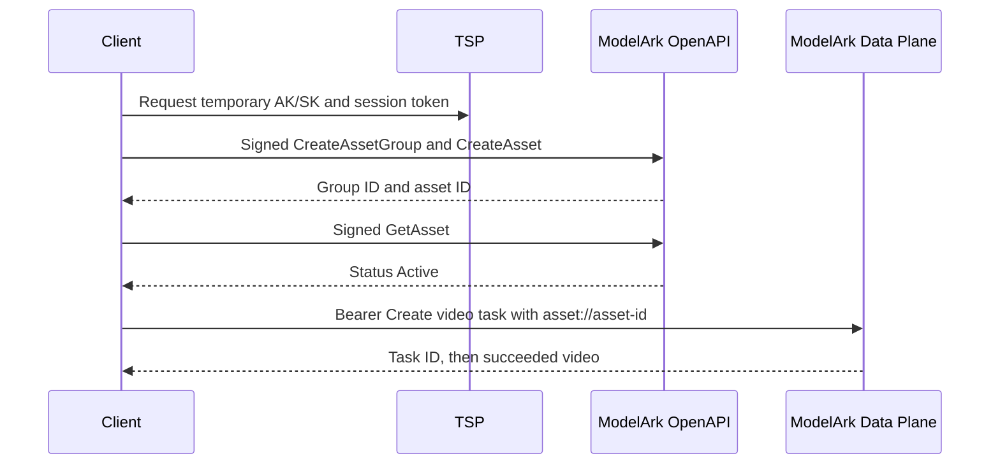

<!-- markdownlint-disable MD013 MD025 -->

# ModelArk Private Asset Library Provider Contract

## Scope and evidence

**This spec records the AIGC image path verified on 2026-09-24.** The live
probe used temporary BytePlus STS credentials, a synthetic cartoon image,
and the `default` ModelArk project. The exact test resources, prompt, and
result are in
[the validation runbook](../plans/PLAN_MODELARK_ASSET_LIBRARY_VALIDATION.md).
The real-human, copyright-IP, and delete paths remain unverified.

## Authentication and routing

**Asset management uses signed BytePlus OpenAPI requests.** The verified
host is `ark.ap-southeast-1.byteplusapi.com`, service `ark`, region
`ap-southeast-1`, version `2024-01-01`, and HMAC-SHA256 signing. Temporary
STS credentials require `X-Security-Token` in the signed headers.

**Generation uses a separate Bearer API key.** The verified data-plane base
URL is `https://ark.ap-southeast.bytepluses.com/api/v3`. The key used for
Seedance generation does not replace OpenAPI AK/SK for asset management.

## Verified management actions

| Action | Request fields used | Observed result |
|---|---|---|
| `ListAssetGroups` | `Filter: {GroupType: "AIGC"}`, `MaxResults`, `ProjectName` | `Result.Items` and `Result.NextToken`. Omitting `Filter` returned `MissingParameter.Filter`. |
| `CreateAssetGroup` | `Name`, `Description`, `GroupType: "AIGC"`, `ProjectName` | `Result.Id` identified the new group. |
| `CreateAsset` | `GroupId`, public HTTPS `URL`, `AssetType: "Image"`, `Name`, `ProjectName` | `Result.Id` identified the new asset. |
| `GetAsset` | `Id`, `ProjectName` | `Result.Status` reached `Active`; the result also contained `GroupId`, `AssetType`, `Name`, `Moderation`, timestamps, and a temporary `URL`. |

**`asset://<asset-id>` is the durable reference for Seedance.** Treat the
`URL` returned by `GetAsset` as temporary and sensitive; do not store it
in durable documentation or logs.

## Verified generation behavior

| Provider | Input | Observed behavior |
|---|---|---|
| Seedance 2.5 | `content[].image_url.url = "asset://<asset-id>"` with `role = "reference_image"` | Task submission and generation succeeded. A four-second, 480p silent video retained the synthetic subject. |
| Seedream 5.0 Pro | `image = "asset://<asset-id>"` | HTTP 400 `InvalidParameter`: invalid URL in `image`. |
| Seed Audio 1.0 | `references[].image_url = "asset://<asset-id>"` | HTTP 400, code `45001132`: unsupported `asset` protocol scheme. |

**Seedream and Seed Audio require another reference route.** A
resolve-to-temporary-URL mode is an implementation option in
[the feature plan](../plans/PLAN_MODELARK_ASSET_LIBRARY.md), but its use
with verified real-human or copyright assets needs written provider
confirmation.

## Unverified contract areas

- Real-human verification session and face matching.
- Copyright-IP management or discovery through OpenAPI.
- Quota, project-mismatch, and face-mismatch error codes.
- Native `asset://` behavior for video and audio references in Seedance.
- Other regions, non-default projects, and long-lived BytePlus AK/SK.
- Resolve-to-URL rights and behavior for real-human and copyright assets.

Do not infer these behaviors from the successful AIGC image probe.

## Server implementation mapping (documented, not yet exercised live)

ark-mcp (`providers/modelark/assets.py`, `docs/assets.md`) also calls the
following actions. Their request shapes come from the BytePlus guides or are
inferred from the verified `Id` convention. Confirm them live before relying
on them.

| Action | Request fields sent | Basis |
|---|---|---|
| `GetAssetGroup` | `Id`, `ProjectName` | Inferred from `GetAsset` |
| `UpdateAssetGroup` | `Id`, `Name?`, `Description?`, `ProjectName` | Inferred |
| `DeleteAssetGroup` | `Id`, `ProjectName` | Inferred; LivenessFace groups have extra authorization-status rules |
| `ListAssets` | `Filter` (`GroupType` always sent; `GroupIds?`, `Statuses?`, `Name?`), `MaxResults`, `NextToken?`, `SortBy?`, `SortOrder?`, `ProjectName` | Documented; `Filter` assumed required as for `ListAssetGroups` |
| `UpdateAsset` | `Id`, `Name`, `ProjectName` | Inferred |
| `DeleteAsset` | `Id`, `ProjectName` | Inferred |
| `CreateVisualValidateSession` | `CallbackURL`, `ProjectName` → `BytedToken`, `H5Link` | Documented (real-human guide) |
| `GetVisualValidateResult` | `BytedToken` (valid ~30 min), `ProjectName` → `GroupId` | Documented; the response while still pending is unknown |

Server behavior tied to this contract:

- A `ResponseMetadata.Error` is treated as a failure even with HTTP 200;
  `InvalidAccessKey` (100009) and `InvalidSecretToken` (100026) are
  non-retryable.
- 429 and throttling codes are retryable. A 5xx on a mutating action
  (`Create*`, `Update*`, `Delete*`, `CreateVisualValidateSession`) is
  ambiguous and never retried automatically.
- `asset://` is forwarded only to Seedance. For Seedream and Seed Audio the
  server rejects it (`BYTEPLUS_MODELARK_ASSET_REFERENCE_MODE=off`) or
  substitutes the `GetAsset` URL (`resolve`, experimental).
